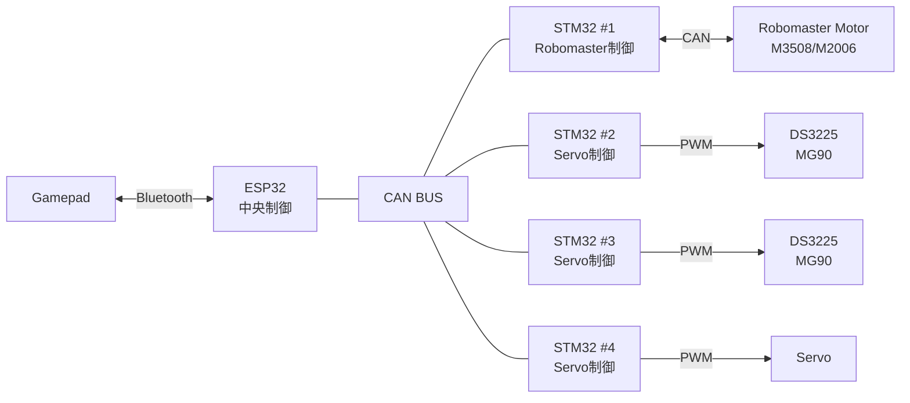

# CatchRobo_2026
キャチロボ2026で使用する回路データおよび複数マイコンのプログラムを一括管理するリポジトリです.

## Directory structure
```text
CatchRobo_2026/
├── ESP32/
│   └── controller/
│       └── ESP32による中央制御
│
├── STM32/
│   └── servo/
│       └── サーボ制御基板
│
└── Kicad/
    └── servo/
        └── 回路図・基板設計データ
```
## Hardware

### Actuator
- Robomaster M3508
- Robomaster M2006
- DS3225 Servo
- MG90 Servo

### Communication
- CAN (ESP32 - STM32, STM32 - Robomaster)

## System overview




## Development environment

### ESP32

#### Hardware
- ESP32-DevKitC-32E

#### Software
- ESP-IDF v5.5.x
- VS Code + ESP-IDF Extension


### STM32

#### Hardware
- STM32 NUCLEO-F303K8

#### Software
- STM32CubeMX
- CMake
- VS Code


### KiCad

#### Software
- KiCad 10.0


## Build

### ESP32

#### Setup
[ESP-IDF環境構築手順（Windows）](https://app.notion.com/p/Windows-36e23f78736380f7b838e187b781a125?v=2cd23f78736380928f93000c8fceebd6&source=copy_link)

[ESP-IDF環境構築手順（Linux）](https://app.notion.com/p/L-32323f7873638072bacfeb84175d09c4?v=2cd23f78736380928f93000c8fceebd6&source=copy_link)

#### Build
```bash
idf.py build
```
#### Flash
```bash
idf.py flash
```

### STM32
#### Build
```bash
cd STM32/servo
cmake -B build
cmake --build build
```