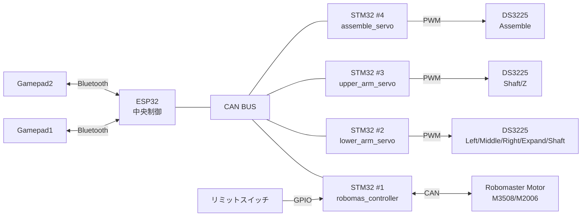

# CatchRobo_2026
キャチロボ2026で使用する回路データおよび複数マイコンのプログラムを一括管理するリポジトリ.
Team: OBT

## Directory structure
```text
CatchRobo_2026/
├── common/                     ESP32/STM32が共有するプラットフォーム非依存コード
│   ├── arm/
│   │   └── アームの物理パラメータ・ホーミング関連定数・出場チーム(ROBOT_TEAM)
│   │
│   ├── can_protocol/
│   │   └── CAN IDとデータフォーマットの対応定義
│   │
│   └── coordinate/
│       └── 直交座標・極座標変換
│
├── ESP32/
│   └── controller/
│       └── Main Controller(プロコン入力の受信とCANによる各STM32への指令)
│
├── STM32/
│   ├── common/
│   │   └── can/
│   │       └── STM32 HAL CANを使ったCAN送信のラッパー
│   │
│   ├── robomas_controller/
│   │   └── 両アームのr軸・deg軸(Robomaster)制御．ホーミング処理の中枢
│   │
│   ├── lower_arm_servo/
│   │   └── 下アームのハンド(Left/Middle/Right/Expand)とShaftサーボ制御
│   │
│   ├── upper_arm_servo/
│   │   └── 上アームのShaft/Zサーボ制御
│   │
│   └── assemble_servo/
│       └── 整理機構のサーボ制御
│
└── Kicad/
    ├── ESP/
    │   └── ESP Main Controller基板
    ├── STM32F303K8_lower_arm_servo/
    │   └── サーボ制御基板(lower_arm_servo/upper_arm_servo/assemble_servoで共用)
    ├── STM32F446RE_robomas_controller/
    │   └── ロボマス制御基板
    ├── servo/
    │   └── サーボ用補助基板
    └── library/
        └── 共通シンボル・フットプリント
```

各ディレクトリの詳細は，それぞれのREADMEを参照．

| ディレクトリ | README |
| :--- | :--- |
| 共有コード | [common/README.md](common/README.md) |
| CAN通信仕様 | [common/can_protocol/README.md](common/can_protocol/README.md) |
| Main Controller | [ESP32/controller/README.md](ESP32/controller/README.md) |
| STM32全体 | [STM32/README.md](STM32/README.md) |
| 部品リスト | [Kicad/README.md](Kicad/README.md) |

## Hardware

### Actuator
- Robomaster M3508
- Robomaster M2006
- DS3225 Servo

### Sensor
- リミットスイッチ(ホーミング用，robomas_controllerに接続)

### Communication
- CAN 1Mbps (ESP32 - STM32, STM32 - Robomaster)

CAN ID・データフォーマットの仕様は [common/can_protocol/README.md](common/can_protocol/README.md) を参照．

## System overview


```mermaid
graph LR
    Pad1[Gamepad1] <-->|Bluetooth| ESP32[ESP32<br>中央制御]
    Pad2[Gamepad2] <-->|Bluetooth| ESP32

    ESP32 --- CAN[CAN BUS]

    CAN --- STM1[STM32 #1<br>robomas_controller]
    CAN --- STM2[STM32 #2<br>lower_arm_servo]
    CAN --- STM3[STM32 #3<br>upper_arm_servo]
    CAN --- STM4[STM32 #4<br>assemble_servo]

    STM1 <-->|CAN| Motor[Robomaster Motor<br>M3508/M2006]
    Limit[リミットスイッチ] -->|GPIO| STM1
    STM2 -->|PWM| Servo1[DS3225<br>Left/Middle/Right/Expand/Shaft]
    STM3 -->|PWM| Servo2[DS3225<br>Shaft/Z]
    STM4 -->|PWM| Servo3[DS3225<br>Assemble]
```


## Development environment

### ESP32

#### Hardware
- ESP32-DevKitC-32E

#### Software
- ESP-IDF v5.5.4
- VS Code + ESP-IDF Extension


### STM32

#### Hardware
- STM32 NUCLEO-F303K8
- STM32 NUCLEO-F446RE

#### Software
- STM32CubeMX
- CMake
- VS Code + STM32CubeIDE Extension


### KiCad

#### Software
- KiCad 10.0


## Build

### ESP32

#### Setup
[ESP-IDF環境構築手順（Windows）](https://app.notion.com/p/Windows-36e23f78736380f7b838e187b781a125?v=2cd23f78736380928f93000c8fceebd6&source=copy_link)

[ESP-IDF環境構築手順（Linux）](https://app.notion.com/p/L-32323f7873638072bacfeb84175d09c4?v=2cd23f78736380928f93000c8fceebd6&source=copy_link)

#### Build
```bash
idf.py build
```
#### Flash
```bash
idf.py flash
```

### STM32

#### Setup
[Qiita: STM32の開発をVSCodeで行う](https://qiita.com/tanutanup/items/d680c92f5168fc3f0182) [@tanutanup(tanutanu p)様](https://qiita.com/tanutanup)

#### Build
各プロジェクト(`STM32/lower_arm_servo`, `STM32/upper_arm_servo`, `STM32/robomas_controller`, `STM32/assemble_servo`)のディレクトリで実行する．
```bash
cmake --preset Release
cmake --build --preset Release
```

## 出場チーム(ROBOT_TEAM)の設定

赤/青チームはフィールドが鏡合わせで，整理機構を左右逆側に取り付けるため，DEG軸のホーミング原点やShaftサーボの回転方向をチームごとに切り替える必要がある．

出場チームは `common/arm/inc/arm.h` の `ROBOT_TEAM`(`ROBOT_TEAM_RED` / `ROBOT_TEAM_BLUE`)としてビルド時の定数で持たせている．緊急停止スイッチでESP32/STM32が再起動しても値を保持する必要があるため，実行時に切り替える方式にはしていない．

**出場チームに応じて`arm.h`のこの値を書き換えた後は，`arm.h`を使う全ファームウェア(ESP32 Main Controller，STM32の`robomas_controller` / `lower_arm_servo` / `upper_arm_servo`)を必ずビルド・書き込みし直すこと．** 値がずれると，DEG軸のホーミングで検出するリミットスイッチと回転方向が基板間で食い違い，可動域の反対側の固定端に衝突する恐れがある．

詳細は [STM32/robomas_controller/README.md](STM32/robomas_controller/README.md) を参照．

## CI

`.github/workflows/` でpush/pull request時に全ファームウェアのビルドを確認している．

| Workflow | 内容 |
| :--- | :--- |
| `esp32-build.yml` | `ESP32/controller` をESP-IDF v5.5.4でビルド |
| `stm32-build.yml` | STM32の4プロジェクトを`cmake --preset Release`でビルド |

ESP-IDFのバージョンとSTM32のツールチェーンは，上記「Development environment」およびDev Containerの設定と揃えること．

## Dev Container (Docker)

ESP-IDF拡張とSTM32系拡張は同じVS Codeウィンドウで有効になっていると干渉するため，用途別にDev Container(Docker)を分けている．必要な拡張機能だけがコンテナ内にインストールされるので，都度手動で拡張をオン/オフする必要がない．

| フォルダを開く | 使うコンテナ | 有効になる拡張 |
| :--- | :--- | :--- |
| `ESP32/controller` | `ESP32/controller/.devcontainer` | ESP-IDF |
| `STM32` | `STM32/.devcontainer` | clangd, CMake Tools, Cortex-Debug |

使い方: 対象のフォルダ(リポジトリ全体ではなく上表のフォルダ)を`File > Open Folder...`で開き，コマンドパレットから`Dev Containers: Reopen in Container`を実行する．どちらのコンテナも各プロジェクトが参照する`common/`(リポジトリ直下)を含むリポジトリ全体をマウントしたうえで，開いたフォルダをエディタ上のワークスペースフォルダとして表示する．

`STM32/.devcontainer`は`lower_arm_servo`/`upper_arm_servo`/`robomas_controller`/`assemble_servo`の4プロジェクト共通で，どのプロジェクトも同じコンテナ内でビルドできる(各プロジェクトのディレクトリに`cd`して上記の`cmake --preset`コマンドを実行)．

`ESP32/controller/.devcontainer`はコンテナ作成時に`components/procon`が依存するBluepad32/BTstack(`~/.espressif/bluepad32`)を自動で取得する(`esp32-build.yml`と同じ手順)．取得結果はDockerボリュームにキャッシュされるため，コンテナを再作成しても毎回cloneし直すことはない．

ST-Link/シリアルポート経由でのフラッシュ・デバッグにはUSBデバイスをコンテナに渡す必要があり，Linuxホスト以外(Windows/macOS)では別途パススルー設定が必要な場合がある．
