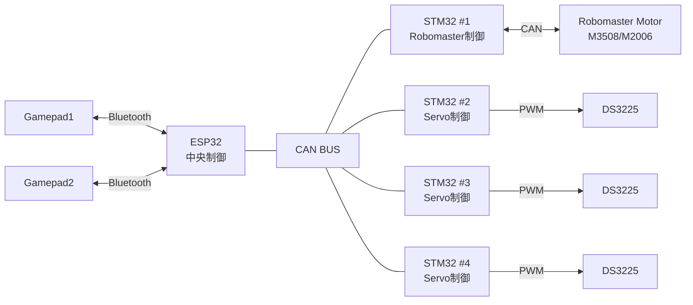

# CatchRobo_2026
キャチロボ2026で使用する回路データおよび複数マイコンのプログラムを一括管理するリポジトリ.
Team: OBT

## Directory structure
```text
CatchRobo_2026/
├── common/
│   ├── arm/
│   │   └── アームの可動域・ホーミング関連定数(ESP32/STM32共通)
│   │
│   ├── can_protocol/
│   │   └── canのidとdataの対応
│   │
│   └── coordinate/
│       └── 直交，極座標変換
│
├── ESP32/
│   └── controller/
│       └── ESP32による中央制御
│
├── STM32/
│   ├── common/
│   │   └── can
│   │       └── ESP-STM間のcanの処理
│   │
│   ├── lower_arm_servo/
│   │   └── 下側アームのサーボ制御
│   │
│   ├── upper_arm_servo/
│   │   └── 上側アームのサーボ制御
│   │
|   └── robomas_controller/
│       └── 両アームのロボマス制御
│
└── Kicad/
    └── servo/
        └── 回路図・基板設計データ
```
## Hardware

### Actuator
- Robomaster M3508
- Robomaster M2006
- DS3225 Servo

### Communication
- CAN (ESP32 - STM32, STM32 - Robomaster)

## System overview


```mermaid
graph LR
    Pad1[Gamepad1] <-->|Bluetooth| ESP32[ESP32<br>中央制御]
    Pad2[Gamepad2] <-->|Bluetooth| ESP32

    ESP32 --- CAN[CAN BUS]

    CAN --- STM1[STM32 #1<br>Robomaster制御]
    CAN --- STM2[STM32 #2<br>Servo制御]
    CAN --- STM3[STM32 #3<br>Servo制御]
    CAN --- STM4[STM32 #4<br>Servo制御]

    STM1 <-->|CAN| Motor[Robomaster Motor<br>M3508/M2006]
    STM2 -->|PWM| Servo1[DS3225]
    STM3 -->|PWM| Servo2[DS3225]
    STM4 -->|PWM| Servo3[DS3225]
```


## Development environment

### ESP32

#### Hardware
- ESP32-DevKitC-32E

#### Software
- ESP-IDF v5.5.4
- VS Code + ESP-IDF Extension


### STM32

#### Hardware
- STM32 NUCLEO-F303K8
- STM32 NUCLEO-F446RE

#### Software
- STM32CubeMX
- CMake
- VS Code + STM32CubeIDE Extension


### KiCad

#### Software
- KiCad 10.0


## Build

### ESP32

#### Setup
[ESP-IDF環境構築手順（Windows）](https://app.notion.com/p/Windows-36e23f78736380f7b838e187b781a125?v=2cd23f78736380928f93000c8fceebd6&source=copy_link)

[ESP-IDF環境構築手順（Linux）](https://app.notion.com/p/L-32323f7873638072bacfeb84175d09c4?v=2cd23f78736380928f93000c8fceebd6&source=copy_link)

#### Build
```bash
idf.py build
```
#### Flash
```bash
idf.py flash
```

### STM32

#### Setup
[Qiita: STM32の開発をVSCodeで行う](https://qiita.com/tanutanup/items/d680c92f5168fc3f0182) [@tanutanup(tanutanu p)様](https://qiita.com/tanutanup)

#### Build
```bash
cmake -B build
cmake --build build
```
